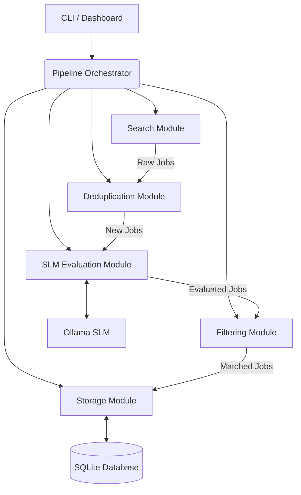

# Architecture

The LinkedIn Job Agent is designed as a pipeline-based system with a modular architecture.

## Component Diagram

## Pipeline Stages

1. **Search**: The search module fetches job postings from LinkedIn based on configured keywords and locations.
2. **Deduplication**: Checks new jobs against the database to prevent duplicate processing using job IDs.
3. **Evaluate**: Connects to a local Ollama SLM to analyze job descriptions and score them against the user's profile and preferences.
4. **Filter**: Filters out jobs that do not meet the minimum score threshold.
5. **Persist**: Saves the evaluated and matched jobs to the SQLite database.
6. **Export**: (Optional) Exports the results to a structured format for external usage.

## Data Models and Schema

The application uses SQLAlchemy (or raw SQLite) with the following core entity:

- **Job**: Represents a job posting.
  - `id` (String, Primary Key)
  - `title` (String)
  - `company` (String)
  - `location` (String)
  - `description` (Text)
  - `url` (String)
  - `score` (Integer)
  - `evaluation_reason` (Text)
  - `status` (String)

## Storage Strategy

The primary data store is **SQLite**, configured to use **WAL (Write-Ahead Logging)** mode. This ensures high concurrency and better performance, allowing the background pipeline to write data while the Streamlit dashboard reads from it simultaneously.
